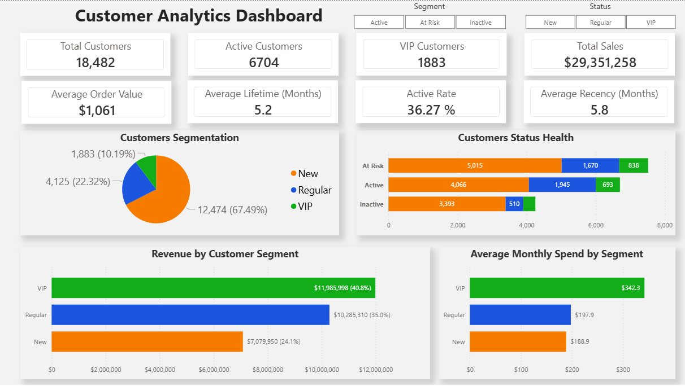
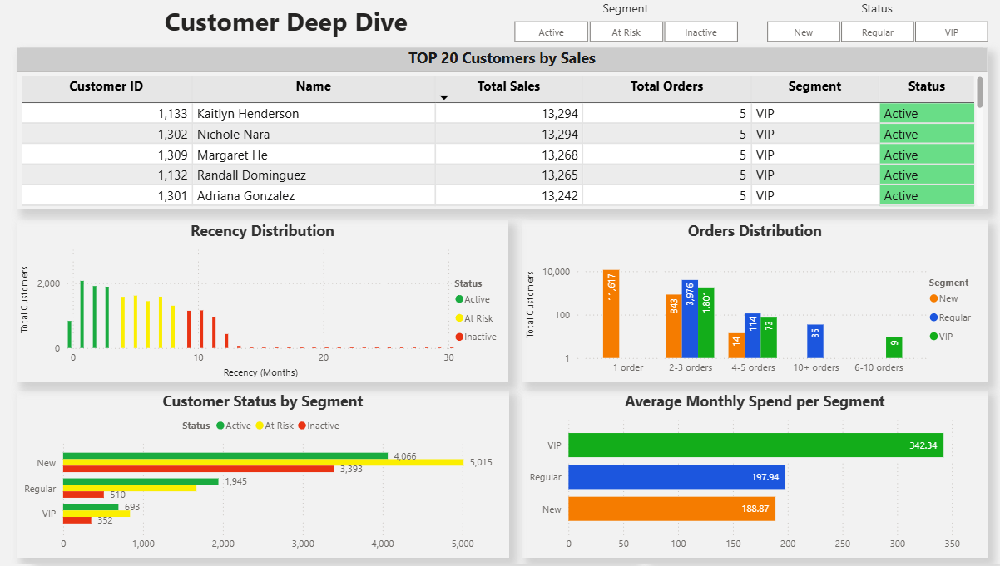
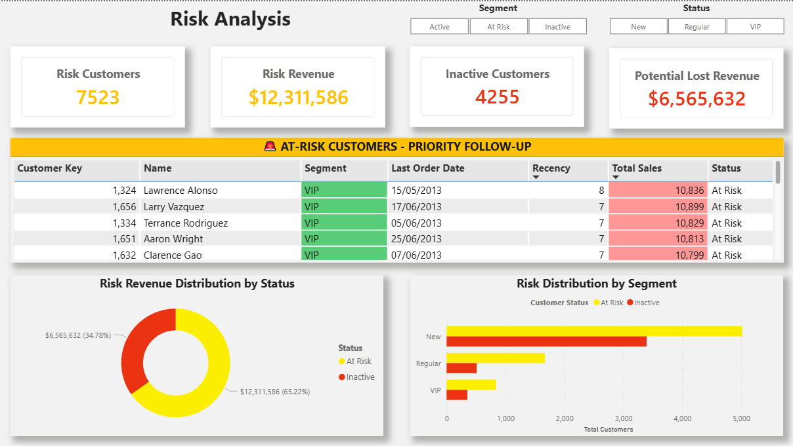

# Customer Analytics Dashboard

**SQL-based customer segmentation and risk analysis project using Power BI**

## 📊 Project Overview

This project analyzes 18,000+ customer records to identify at-risk customers, segment the customer base, and provide actionable insights for Customer Success Operations. Built using SQL Server and Power BI.

## 🎯 Business Problem

Customer Success teams need to:
- Identify high-value customers at risk of churning
- Segment customers for targeted campaigns
- Monitor customer health metrics in real-time
- Prioritize outreach based on revenue impact

## 💡 Solution

Built a 3-page interactive Power BI dashboard connected to SQL Server that:
1. Segments 18,482 customers into VIP (10%), Regular (22%), and New (67%) tiers
2. Identifies 7,523 at-risk customers representing $12.3M in revenue
3. Tracks customer health metrics (active rate, retention, recency)
4. Provides prioritized list of at-risk VIP customers for immediate action

## 🛠️ Technical Stack

- **Database:** SQL Server
- **ETL/Analysis:** T-SQL (CTEs, Window Functions, Stored Procedures)
- **Visualization:** Power BI Desktop
- **Key Techniques:** Customer segmentation, cohort analysis, risk scoring

## 📂 Repository Structure
```
├── sql-queries/          # SQL scripts for data exploration and VIEW creation
│   ├── 00-11_*.sql      # Exploratory Data Analysis queries
│   ├── 12_report_customers.sql    # Main customer analytics VIEW
│   ├── 13_report_products.sql     # Product analytics VIEW
│   └── 14_segmentation_fix_notes.sql  # Documentation of bug fixes
├── dashboard/           # Power BI dashboard file
│   └── CustomerAnalyticsDashboard.pbix
├── screenshots/         # Dashboard preview images
│   ├── page1_overview.png
│   ├── page2_deep_dive.png
│   └── page3_risk_analysis.png
└── README.md
```

## 📊 Dashboard Pages

### Page 1: Customer Analytics Overview


**Key Metrics:**
- Total Customers: 18,482
- Active Customers: 6,704 (36.3%)
- VIP Customers: 1,883 (10.2%)
- Total Revenue: $29.4M

**Insights:**
- Customer segmentation by tier (VIP/Regular/New)
- Customer health status distribution
- Revenue contribution by segment
- Average monthly spend analysis

### Page 2: Customer Deep Dive


**Features:**
- Top 20 customers by revenue with conditional formatting
- Recency distribution (months since last order)
- Order frequency distribution by segment
- Customer status breakdown (Active/At Risk/Inactive)

### Page 3: Customer Risk Analysis


**Risk Metrics:**
- At-Risk Customers: 7,523
- Inactive Customers: 4,255
- At-Risk Revenue: $12.3M
- Potential Lost Revenue: $6.6M

**Features:**
- Prioritized list of at-risk VIP customers
- Risk distribution by customer segment

## 🔍 Technical Highlights

### Customer Segmentation Logic

Fixed threshold segmentation didn't match real data distribution:
- Original: VIP required 12+ months tenure + $5K+ sales
- Problem: 95% of customers had <12 months tenure → nearly all classified as "New"

**Solution:** Recalibrated using data percentiles:
```sql
CASE 
    WHEN total_sales >= 4826 AND lifespan >= 4 THEN 'VIP'    -- P90 sales, realistic tenure
    WHEN total_sales <  4826 AND lifespan >= 4 THEN 'Regular'
    ELSE 'New'
END
```

**Result:**
- VIP: 10.2% (realistic top tier)
- Regular: 22.3% (established base)
- New: 67.5% (recent customers)

### Key SQL Techniques Used

- **Window Functions:** Running totals, ranking, percentile calculations
- **CTEs:** Modular query structure for complex transformations
- **Data Quality:** NULL handling, duplicate detection, outlier management
- **Business Logic:** Customer lifecycle stages, risk scoring, cohort definitions

## 📈 Key Insights

1. **Revenue Concentration:** VIP customers (10%) generate 48% of total revenue
2. **Churn Risk:** 7,523 customers at risk representing $12.3M in revenue
3. **Engagement Gap:** 67% of customer base are "New" with single purchases
4. **VIP Health:** 693 VIP customers (37% of VIPs) are Active vs 352 At Risk

## 🚀 Skills Demonstrated

- **SQL:** Complex queries, VIEW creation, data transformations, window functions
- **Data Analysis:** Customer segmentation, cohort analysis, risk identification
- **Data Visualization:** Multi-page dashboards, conditional formatting, interactivity
- **Business Intelligence:** KPI definition, metric calculation, insight generation
- **Problem Solving:** Identified and fixed segmentation logic bug using percentile analysis

## 📞 Contact

Christian Ivan De La Rosa Medina
chrisseguro17@gmail.com
https://www.linkedin.com/in/christiandelarosam/

**Note:** This project was completed as part of a comprehensive SQL and Power BI customer-success-related project, with additional enhancements including recalibrated segmentation logic, risk analysis, and custom visualizations.
